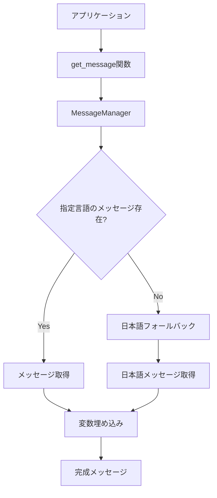
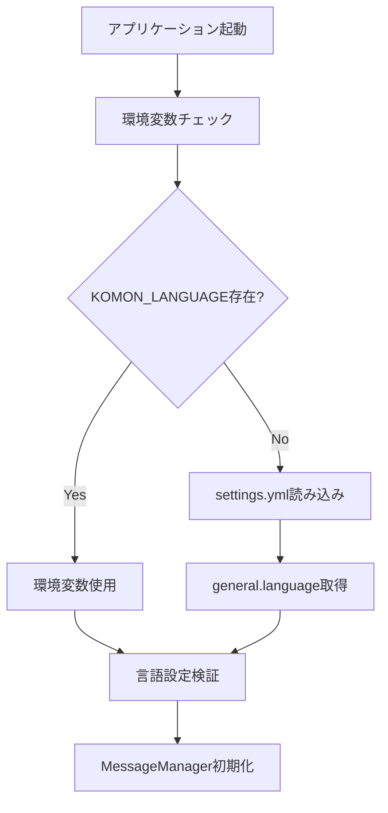

# 多言語化対応 - 設計書

## アーキテクチャ概要

### 設計思想
- **軽量性の維持**: 追加依存関係なし、シンプルな実装
- **後方互換性**: 既存ユーザーへの影響ゼロ
- **拡張性**: 新しい言語の追加が容易
- **保守性**: メッセージ管理が簡単

### 全体構成
```
src/komon/
├── messages.py          # メッセージテンプレートシステム（新規）
├── i18n/               # 言語ファイル（新規）
│   ├── ja.py           # 日本語メッセージ
│   └── en.py           # 英語メッセージ
├── notification.py      # 通知機能（既存・修正）
├── analyzer.py         # 分析機能（既存・修正）
└── contextual_advisor.py # アドバイス機能（既存・修正）
```

## コンポーネント設計

### 1. メッセージテンプレートシステム (`messages.py`)

#### MessageManager クラス
```python
class MessageManager:
    """多言語メッセージ管理クラス"""
    
    def __init__(self, language='ja'):
        self.language = language
        self._messages = self._load_messages(language)
    
    def get(self, key: str, **kwargs) -> str:
        """メッセージを取得"""
        template = self._messages.get(key, '')
        if not template:
            # フォールバック: 日本語を試行
            if self.language != 'ja':
                fallback_messages = self._load_messages('ja')
                template = fallback_messages.get(key, f'[Missing: {key}]')
        
        return template.format(**kwargs) if kwargs else template
    
    def _load_messages(self, language: str) -> dict:
        """言語ファイルを読み込み"""
        try:
            module = importlib.import_module(f'komon.i18n.{language}')
            return module.MESSAGES
        except ImportError:
            if language != 'ja':
                # フォールバック: 日本語
                return self._load_messages('ja')
            raise
```

#### グローバルインスタンス
```python
# モジュールレベルでのシングルトン
_message_manager = None

def get_message_manager() -> MessageManager:
    """MessageManagerのシングルトンインスタンスを取得"""
    global _message_manager
    if _message_manager is None:
        from .settings_validator import get_language_setting
        language = get_language_setting()
        _message_manager = MessageManager(language)
    return _message_manager

def get_message(key: str, **kwargs) -> str:
    """便利関数: メッセージを取得"""
    return get_message_manager().get(key, **kwargs)
```

### 2. 言語ファイル構造

#### 日本語ファイル (`i18n/ja.py`)
```python
"""日本語メッセージ定義"""

MESSAGES = {
    # CPU関連
    'cpu_high_warning': '💬 CPUが頑張りすぎてるみたいです（{usage}%）',
    'cpu_high_alert': '💬 CPUがかなり頑張ってます（{usage}%）',
    'cpu_high_critical': '🔥 CPUが限界近くまで頑張ってます（{usage}%）',
    
    # メモリ関連
    'memory_high_warning': '💬 メモリ使用率が高めです（{usage}%）',
    'memory_high_alert': '💬 メモリがちょっと気になる水準です（{usage}%）',
    'memory_high_critical': '🔥 メモリがかなり逼迫しています（{usage}%）',
    
    # ディスク関連
    'disk_high_warning': '💬 ディスク使用率が気になります（{usage}%）',
    'disk_high_alert': '💬 ディスクがちょっと心配な水準です（{usage}%）',
    'disk_high_critical': '🔥 ディスクがかなり逼迫しています（{usage}%）',
    
    # プロセス関連
    'process_advice_node': '💡 開発サーバーやビルドプロセスの可能性があります',
    'process_advice_docker': '💡 コンテナが高負荷です。不要なコンテナを停止してみてください',
    'process_advice_python': '💡 機械学習の学習プロセスやデータ処理スクリプトの可能性があります',
    
    # システム状態
    'system_status_normal': '✅ システムは正常です',
    'system_status_warning': '⚠️ 注意が必要な項目があります',
    'system_status_critical': '🔴 緊急対応が必要です',
    
    # ネットワーク
    'network_ping_success': '✅ {name} への ping が成功しました',
    'network_ping_failed': '❌ {name} への ping が失敗しました',
    'network_http_success': '✅ {name} への HTTP接続が成功しました',
    'network_http_failed': '❌ {name} への HTTP接続が失敗しました（{status}）',
    
    # 週次レポート
    'weekly_report_title': '📊 週次健全性レポート ({start_date} 〜 {end_date})',
    'weekly_report_stable': '✅ システムは安定しています',
    'weekly_report_trend_up': '📈 リソース使用量が増加傾向です',
    'weekly_report_trend_down': '📉 リソース使用量が減少傾向です',
}
```

#### 英語ファイル (`i18n/en.py`)
```python
"""English message definitions"""

MESSAGES = {
    # CPU related
    'cpu_high_warning': '💬 CPU usage is getting a bit high ({usage}%)',
    'cpu_high_alert': '💬 CPU is working quite hard ({usage}%)',
    'cpu_high_critical': '🔥 CPU usage is critically high ({usage}%)',
    
    # Memory related
    'memory_high_warning': '💬 Memory usage is getting high ({usage}%)',
    'memory_high_alert': '💬 Memory usage is at a concerning level ({usage}%)',
    'memory_high_critical': '🔥 Memory is critically low ({usage}%)',
    
    # Disk related
    'disk_high_warning': '💬 Disk usage is worth watching ({usage}%)',
    'disk_high_alert': '💬 Disk usage is at a concerning level ({usage}%)',
    'disk_high_critical': '🔥 Disk space is critically low ({usage}%)',
    
    # Process related
    'process_advice_node': '💡 This might be a development server or build process',
    'process_advice_docker': '💡 Container is under high load. Consider stopping unnecessary containers',
    'process_advice_python': '💡 This might be a machine learning training process or data processing script',
    
    # System status
    'system_status_normal': '✅ System is running normally',
    'system_status_warning': '⚠️ Some items need attention',
    'system_status_critical': '🔴 Immediate action required',
    
    # Network
    'network_ping_success': '✅ Ping to {name} succeeded',
    'network_ping_failed': '❌ Ping to {name} failed',
    'network_http_success': '✅ HTTP connection to {name} succeeded',
    'network_http_failed': '❌ HTTP connection to {name} failed ({status})',
    
    # Weekly report
    'weekly_report_title': '📊 Weekly Health Report ({start_date} - {end_date})',
    'weekly_report_stable': '✅ System is stable',
    'weekly_report_trend_up': '📈 Resource usage is trending upward',
    'weekly_report_trend_down': '📉 Resource usage is trending downward',
}
```

### 3. 設定ファイル拡張

#### settings.yml の拡張
```yaml
# 既存設定...

general:
  language: ja  # ja, en, zh, ko, etc.
  # デフォルトは日本語
  
# 環境変数での指定も可能
# KOMON_LANGUAGE=en
```

#### 設定読み込み機能の拡張
```python
# settings_validator.py に追加
def get_language_setting() -> str:
    """言語設定を取得"""
    # 環境変数を優先
    env_lang = os.getenv('KOMON_LANGUAGE')
    if env_lang:
        return env_lang.lower()
    
    # 設定ファイルから取得
    settings = load_settings()
    return settings.get('general', {}).get('language', 'ja').lower()

def validate_language_setting(language: str) -> str:
    """言語設定を検証"""
    supported_languages = ['ja', 'en']
    if language not in supported_languages:
        logger.warning(f"Unsupported language '{language}', falling back to 'ja'")
        return 'ja'
    return language
```

### 4. 既存モジュールの修正

#### notification.py の修正
```python
# Before
def send_slack_alert(message, webhook_url):
    payload = {
        "text": f"⚠️ Komon 警戒情報:\n{message}"
    }
    # ...

# After
from .messages import get_message

def send_slack_alert(message_key, webhook_url, **kwargs):
    message = get_message(message_key, **kwargs)
    payload = {
        "text": f"⚠️ Komon: {message}"
    }
    # ...
```

#### analyzer.py の修正
```python
# Before
def analyze_cpu_usage(usage):
    if usage > 90:
        return "CPUがかなり頑張ってます"
    # ...

# After
from .messages import get_message

def analyze_cpu_usage(usage):
    if usage > 90:
        return get_message('cpu_high_critical', usage=usage)
    elif usage > 80:
        return get_message('cpu_high_alert', usage=usage)
    elif usage > 70:
        return get_message('cpu_high_warning', usage=usage)
    return None
```

## データフロー

### メッセージ取得フロー


### 設定読み込みフロー


## 正確性プロパティ

### Property-001: メッセージ一貫性 (AC-002, AC-003)
**検証対象**: AC-002（日本語メッセージ）, AC-003（英語メッセージ）

**プロパティ**: 全ての定義済みメッセージキーに対して、日本語と英語の両方のメッセージが存在する

**検証方法**:
```python
def test_message_consistency():
    """全言語でメッセージキーが一致することを検証"""
    ja_messages = importlib.import_module('komon.i18n.ja').MESSAGES
    en_messages = importlib.import_module('komon.i18n.en').MESSAGES
    
    ja_keys = set(ja_messages.keys())
    en_keys = set(en_messages.keys())
    
    assert ja_keys == en_keys, f"Missing keys: {ja_keys.symmetric_difference(en_keys)}"
```

### Property-002: フォールバック動作 (AC-005)
**検証対象**: AC-005（フォールバック機能）

**プロパティ**: 存在しないメッセージキーまたは言語に対して、適切にフォールバックする

**検証方法**:
```python
def test_fallback_behavior():
    """フォールバック動作を検証"""
    # 存在しない言語
    manager = MessageManager('xx')
    message = manager.get('cpu_high_warning', usage=85)
    assert '85' in message  # 日本語メッセージにフォールバック
    
    # 存在しないキー
    manager = MessageManager('en')
    message = manager.get('nonexistent_key')
    assert '[Missing:' in message or message != ''  # エラー処理
```

### Property-003: 変数埋め込み正確性 (AC-003, AC-004)
**検証対象**: AC-003（英語メッセージ）, AC-004（テンプレートシステム）

**プロパティ**: 変数埋め込みが全ての言語で正しく動作する

**検証方法**:
```python
def test_variable_interpolation():
    """変数埋め込みの正確性を検証"""
    test_cases = [
        ('cpu_high_warning', {'usage': 85}, '85'),
        ('network_ping_success', {'name': 'Google DNS'}, 'Google DNS'),
    ]
    
    for key, kwargs, expected in test_cases:
        for lang in ['ja', 'en']:
            manager = MessageManager(lang)
            message = manager.get(key, **kwargs)
            assert expected in message, f"Variable not found in {lang}: {message}"
```

### Property-004: 後方互換性 (AC-006)
**検証対象**: AC-006（既存機能への影響なし）

**プロパティ**: 既存の全てのテストが多言語化後も通過する

**検証方法**:
```python
def test_backward_compatibility():
    """後方互換性を検証"""
    # 既存のテストスイートを実行
    # 設定ファイルなしでも動作することを確認
    manager = MessageManager()  # デフォルト言語
    assert manager.language == 'ja'
    
    # 既存の通知機能が動作することを確認
    message = manager.get('cpu_high_warning', usage=85)
    assert message is not None and len(message) > 0
```

## パフォーマンス設計

### メモリ使用量最適化
- **遅延読み込み**: 使用される言語のみメモリに保持
- **シングルトン**: MessageManagerインスタンスを1つのみ作成
- **軽量データ構造**: 辞書による高速アクセス

### 実行時間最適化
- **キャッシュ**: 一度読み込んだメッセージを保持
- **事前検証**: 起動時に言語ファイルの整合性をチェック
- **フォールバック最適化**: 日本語メッセージを事前読み込み

## セキュリティ設計

### 入力検証
- 言語コードの検証（英数字のみ、長さ制限）
- メッセージキーの検証（安全な文字のみ）
- 変数埋め込み時のエスケープ処理

### ファイルアクセス制御
- 言語ファイルは読み取り専用
- パッケージ内のファイルのみアクセス
- 外部ファイル読み込みは禁止

## エラーハンドリング

### エラー分類と対応
1. **言語ファイル読み込みエラー**
   - 対応: 日本語にフォールバック
   - ログ: WARNING レベル

2. **メッセージキー不存在**
   - 対応: `[Missing: key]` 形式で表示
   - ログ: WARNING レベル

3. **変数埋め込みエラー**
   - 対応: 元のテンプレート文字列を返す
   - ログ: ERROR レベル

### ログ出力例
```python
logger.warning(f"Language '{language}' not supported, falling back to Japanese")
logger.warning(f"Message key '{key}' not found in language '{language}'")
logger.error(f"Variable interpolation failed for key '{key}': {str(e)}")
```

## レジリエンス設計

### サーキットブレイカー
```yaml
circuit-breaker:
  considered: true
  decision: "not-adopted"
  rationale: |
    多言語化機能は短命なメッセージ取得処理であり、
    継続的な接続や大量処理を行わない。
    メッセージ取得の失敗は即座にフォールバックで対応するため、
    サーキットブレイカーは不要。
```

### 通知スパム防止
```yaml
notification-throttling:
  considered: true
  decision: "not-applicable"
  rationale: |
    多言語化機能自体は通知を行わない。
    通知スパム防止は既存の通知機能で実装済み。
```

### フォールバック戦略
```yaml
fallback-strategy:
  considered: true
  decision: "adopted"
  rationale: |
    言語ファイルの読み込み失敗やメッセージキー不存在に対して、
    段階的なフォールバック戦略を実装する。
  implementation:
    - "指定言語 → 日本語 → エラーメッセージ"
    - "メッセージキー不存在 → [Missing: key] 形式"
    - "変数埋め込み失敗 → 元テンプレート返却"
```

### その他の考慮事項
```yaml
other-considerations:
  - consideration: "メモリリーク防止"
    decision: "adopted"
    rationale: |
      MessageManagerをシングルトンとして実装し、
      不要なインスタンス生成を防ぐ。
  - consideration: "文字エンコーディング"
    decision: "adopted"
    rationale: |
      全ての言語ファイルをUTF-8で統一し、
      文字化けを防ぐ。
  - consideration: "動的言語切り替え"
    decision: "not-adopted"
    rationale: |
      v1.X.Xでは起動時の言語設定のみサポート。
      動的切り替えは将来のバージョンで検討。
```

## テスト戦略

### ユニットテスト
- MessageManager クラスの全メソッド
- 言語ファイルの整合性
- フォールバック動作
- 変数埋め込み機能

### 統合テスト
- 既存モジュールとの連携
- 設定ファイル読み込み
- 環境変数による言語指定

### プロパティベーステスト
- ランダムな変数値での埋め込み
- 存在しないキーでのフォールバック
- 不正な言語コードでの動作

## 移行戦略

### Phase 1: 基盤実装
- MessageManager クラス実装
- 日本語メッセージファイル作成
- 設定ファイル拡張

### Phase 2: 英語対応
- 英語メッセージファイル作成
- 翻訳品質の確認
- テストケース追加

### Phase 3: 既存機能統合
- 通知機能の修正
- 分析機能の修正
- アドバイス機能の修正

### Phase 4: 検証・リリース
- 全機能テスト
- パフォーマンステスト
- ドキュメント更新

## 運用・保守

### 翻訳管理
- 新しいメッセージ追加時のチェックリスト
- 翻訳品質のレビュープロセス
- コミュニティからの翻訳貢献受け入れ

### モニタリング
- 言語別の使用統計
- フォールバック発生頻度
- エラー発生パターン

### 将来拡張
- 新言語追加の手順書
- 翻訳ツールとの連携
- 動的言語切り替え機能